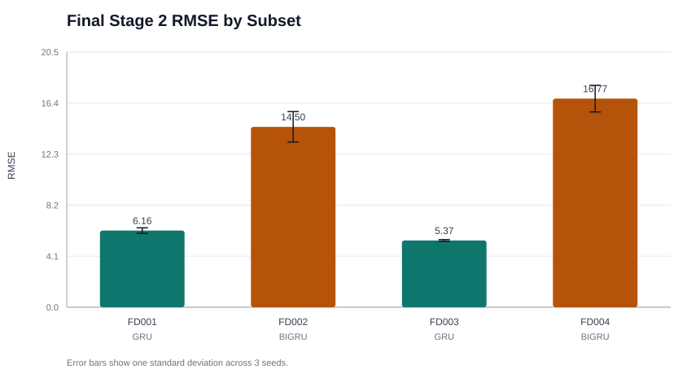
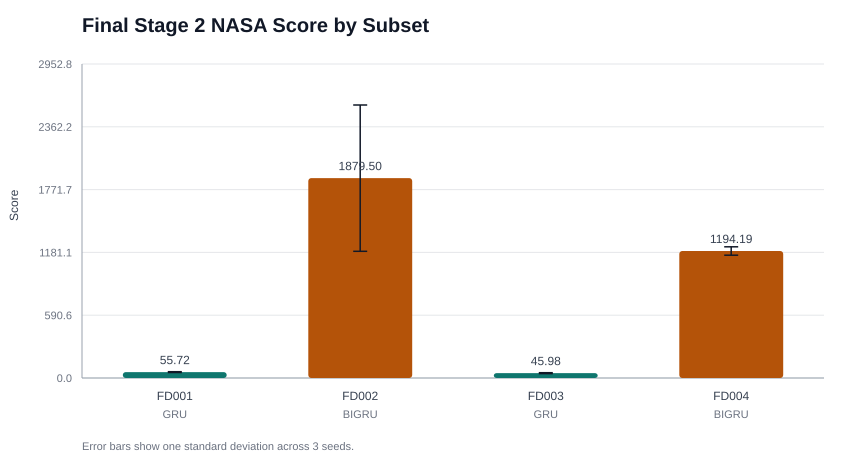
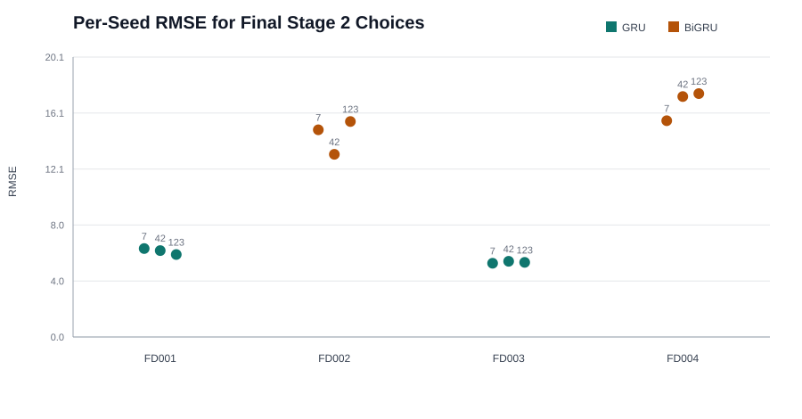
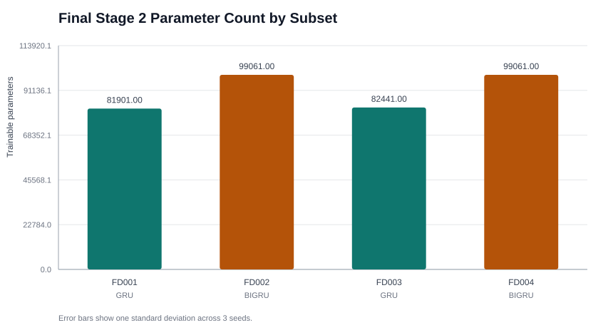

# Stage 2 Backbone Analysis

## Final Results

| Subset | Final model | Config | RMSE mean +/- std | Score mean +/- std | Params |
|---|---|---|---:|---:|---:|
| FD001 | GRU | h90 l2 d0.2 lr0.0005 | 6.165 +/- 0.219 | 55.721 +/- 3.664 | 81,901 |
| FD002 | BIGRU | h60 l2 d0.1 lr0.0005 | 14.502 +/- 1.226 | 1879.504 +/- 688.109 | 99,061 |
| FD003 | GRU | h90 l2 d0.2 lr0.0005 | 5.366 +/- 0.070 | 45.981 +/- 4.259 | 82,441 |
| FD004 | BIGRU | h60 l2 d0.1 lr0.0005 | 16.773 +/- 1.070 | 1194.188 +/- 39.507 | 99,061 |

## Main Findings

The final Stage 2 experiments select different recurrent backbones depending on operating-condition complexity. FD001 and FD003, the simpler one-condition subsets, are best served by the tuned GRU configuration (`h90`, `2` layers, dropout `0.2`, learning rate `5e-4`). FD002 and FD004, which contain six operating conditions, are better served by the tuned BiGRU configuration (`h60`, `2` layers, dropout `0.1`, learning rate `5e-4`).

GRU is the strongest choice on simple subsets:

- FD001: RMSE 6.165 +/- 0.219, Score 55.72 +/- 3.66.
- FD003: RMSE 5.366 +/- 0.070, Score 45.98 +/- 4.26.

BiGRU is the stronger choice on the complex operating-condition subsets:

- FD002: RMSE 14.502 +/- 1.226, Score 1879.50 +/- 688.11.
- FD004: RMSE 16.773 +/- 1.070, Score 1194.19 +/- 39.51.

## Ablation Answers

1. **Which backbone is best on which sub-dataset?** GRU wins on FD001 and FD003; BiGRU wins on FD002 and FD004. There is not a single universal winner across all four subsets.

2. **Does bidirectionality help consistently?** No. Bidirectionality helps most clearly on the more complex FD002/FD004 settings. On FD001/FD003, the simpler GRU is more parameter-efficient and achieves better mean RMSE.

3. **Is the architecture gap larger on simple or complex subsets?** The evidence points to a larger practical gap on complex subsets. FD004 in particular strongly favored BiGRU over the transferred GRU seed-42 comparison, while FD003 showed only a small GRU/BiGRU difference.

4. **How does parameter count trade off against accuracy?** The best GRU setting is compact, with roughly 82k trainable parameters on FD001/FD003. The chosen BiGRU setting is still modest at roughly 99k parameters on FD002/FD004, and the added bidirectional capacity appears worthwhile for complex operating conditions.

## Recommendation for Stage 3

If Stage 3 can use subset-specific backbones, carry forward GRU for FD001/FD003 and BiGRU for FD002/FD004. If Stage 3 requires one global recurrent backbone, BiGRU is the more conservative choice because it handles the complex six-condition subsets better, although GRU remains the stronger and lighter option for the simple subsets.

## Notes

- All final results use three seeds: 7, 42, and 123.
- Model selection used engine-level validation (`validation_enabled=True`) to avoid sample-window leakage between train and validation.
- The checked-in Stage 1 FD001 checkpoint evaluated at RMSE 8.72 with the original `reproduce/main_test.py`; the refactored FD001 LSTM retraining run produced RMSE 8.26. The tuned Stage 2 GRU improves FD001 to RMSE 6.16 +/- 0.22.
